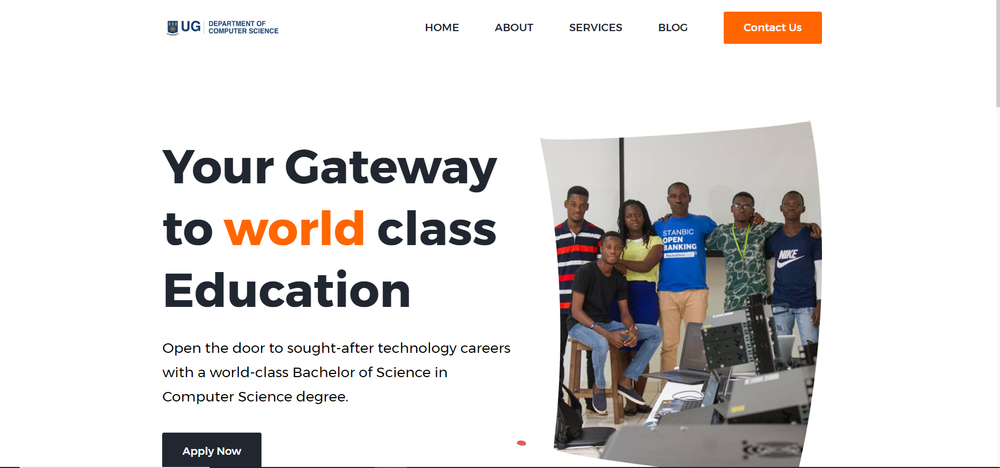

  ### 11140508_DCIT205 IA
  <div align="center">
 
  <br />
  <br />


 

  <h2 align="center">UG | Department of Computer Science</h2>

  UG | Department of Computer Science is a fully responsive education website, <br />Responsive for all devices, build using HTML, CSS, and JavaScript.
  <br>


</div>

<br />
## Demo
   <a href="https://bundana.github.io/11140508_DCIT205/"><strong>➥ Live Demo of Website</strong></a>

### Demo Screeshots




Having issues with screenshots for all devices:

## Webpages
1. **[Home (index.html)](index.html)**  
   - Description: The main landing page for the department.

2. **[About (about.html)](about.html)**  
   - Description: Learn more about the Department of Computer Science.

3. **[Staff (staff.html)](staff.html)**  
   - Description: Meet our dedicated staff members.

4. **[Contact Us (contact-us.html)](contact-us.html)**  
   - Description: Get in touch with the department.

5. **[Events (events.html)](events.html)**  
   - Description: Stay updated on upcoming events.

6. **[Blog (blog.html)](blog.html)**  
   - Description: Explore the latest news and updates.

7. **[Blog Single (blog-single.html)](blog-single.html)**  
   - Description: Details of a specific blog post.

8. **[Catalog (catalog.html)](catalog.html)**  
   - Description: Browse through our course catalog.

9. **[Student Projects (student-projects.html)](student-projects.html)**  
   - Description: Showcase of projects by our talented students.

10. **[Apply (apply.html)](apply.html)**  
    - Description: Information on how to apply to the department.


### Prerequisites

Before you begin, ensure you have met the following requirements:

* [Git](https://git-scm.com/downloads "Download Git") must be installed on your operating system.

### Run Locally
To clone this repository to your local machine, follow these steps:

1. Open your terminal or command prompt.

2. Navigate to the directory where you want to clone the repository.
 
3. To run **11140508_DCIT205** locally, run this command on your git bash:

Windows:

```bash
git   clone https://github.com/bundana/11140508_DCIT205.git
```

Linux and macOS:

```bash
sudo git clone https://github.com/bundana/11140508_DCIT205.git
```


### Contact
Name **Sulemana Abdul Haafiz Bundana**
Student ID **11140508**
If you want to contact with me you can reach me at [Email]absulemana003@st.ug.edu.gh.
 
